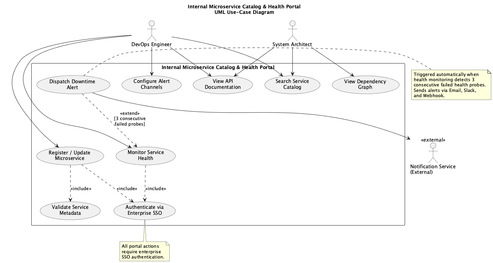
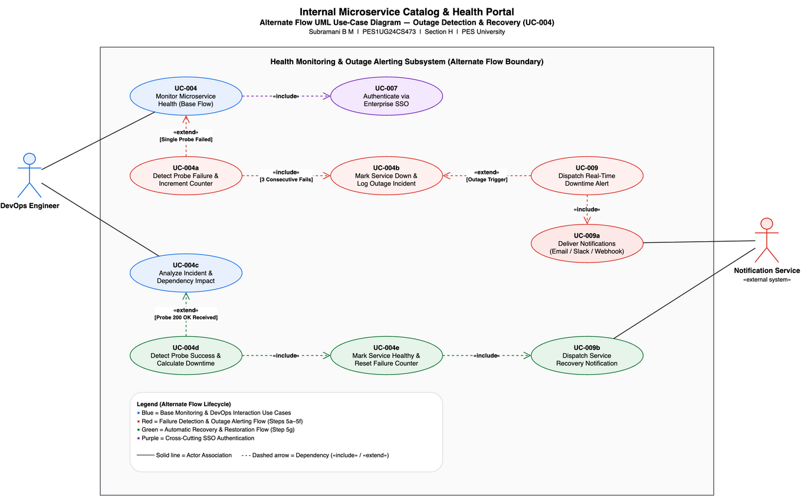

# Problem Statement #42 — Internal Microservice Catalog & Health Portal

**Course:** Software Engineering Lab 1 — Requirements Engineering & UML Use-Case Modelling  
**Department:** Dept. of CSE, PES University  
**Student Name:** Subramani B M  
**SRN:** PES1UG24CS473  
**Section:** H  
**Domain:** Developer Tools & IT Operations  
**Target Stakeholders / Actors:** DevOps Engineer, System Architect  

---

## Problem Context & Overview

An enterprise developer portal mapping microservice dependencies, aggregating API documentation, and running automated periodic health check pingers with downtime alerts.

---

## Deliverables Summary

| # | Deliverable | Format | File Link |
|---|---|---|---|
| **0** | **Original Problem Statement** | PDF | [42_SE_Lab1_SE_Problem_Statements.pdf](42_SE_Lab1_SE_Problem_Statements.pdf) |
| **1** | **Complete Requirements Table** (FR-001 to FR-005, NFR-001 & NFR-002) with ID, Type, Description, Priority, Acceptance Criteria, and Rationale | Markdown & PDF | [requirements.md](requirements.md)<br>[requirements.pdf](requirements.pdf) *(1-Page Formatted PDF)* |
| **2** | **UML Use-Case Diagram (Primary System)** (Actors, Use Cases, System Boundary, `«include»` & `«extend»` relationships) | draw.io + StarUML + PNG | [use_case_diagram.drawio](use_case_diagram.drawio) (draw.io)<br>[use_case_diagram.mdj](use_case_diagram.mdj) (StarUML)<br>[use_case_diagram.png](use_case_diagram.png) (Preview) |
| **3** | **Alternate Flow UML Use-Case Diagram** (Outage Detection, Multi-Channel Alerting & Auto-Recovery Lifecycle) | draw.io + StarUML + PNG | [alternate_flow_use_case_diagram.drawio](alternate_flow_use_case_diagram.drawio) (draw.io)<br>[alternate_flow_use_case_diagram.mdj](alternate_flow_use_case_diagram.mdj) (StarUML)<br>[alternate_flow_use_case_diagram.png](alternate_flow_use_case_diagram.png) (Preview) |
| **4** | **Use-Case Flow Specification** (1-Page specification for *Monitor Service Health* with Preconditions, Postconditions, Main Success Scenario, Alternate Flow) | Markdown & PDF | [use_case_flow_specification.md](use_case_flow_specification.md)<br>[use_case_flow_specification.pdf](use_case_flow_specification.pdf) *(1-Page Formatted PDF)* |
| **5** | **Exception Flow Specification** (Fault handling for Network Timeout, Notification Delivery Failure, TLS Violation, Secrets Vault Unreachable, SSO Token Expiry) | Markdown & PDF | [exception_flow_specification.md](exception_flow_specification.md)<br>[exception_flow_specification.pdf](exception_flow_specification.pdf) *(1-Page Formatted PDF)* |

---

## Primary UML Use-Case Diagram



---

## Alternate Flow UML Use-Case Diagram



---

## Repository Structure

```
.
├── 42_SE_Lab1_SE_Problem_Statements.pdf      # Original problem statement handout (PS #42)
├── README.md                                 # Project overview, student info & deliverable index
├── requirements.md                           # Complete Requirements Table (Markdown)
├── requirements.pdf                          # Complete Requirements Table (1-Page Formatted PDF)
├── use_case_diagram.drawio                   # Primary UML Use-Case Diagram (draw.io source)
├── use_case_diagram.mdj                      # Primary UML Use-Case Diagram (StarUML source)
├── use_case_diagram.png                      # Primary UML Use-Case Diagram (rendered preview)
├── alternate_flow_use_case_diagram.drawio    # Alternate Flow Use-Case Diagram (draw.io source)
├── alternate_flow_use_case_diagram.mdj       # Alternate Flow Use-Case Diagram (StarUML source)
├── alternate_flow_use_case_diagram.png       # Alternate Flow Use-Case Diagram (rendered preview)
├── use_case_flow_specification.md            # Use-Case Flow Specification (Markdown)
├── use_case_flow_specification.pdf           # Use-Case Flow Specification (1-Page Formatted PDF)
├── exception_flow_specification.md           # Exception Flow Specification (Markdown)
└── exception_flow_specification.pdf          # Exception Flow Specification (1-Page Formatted PDF)
```
