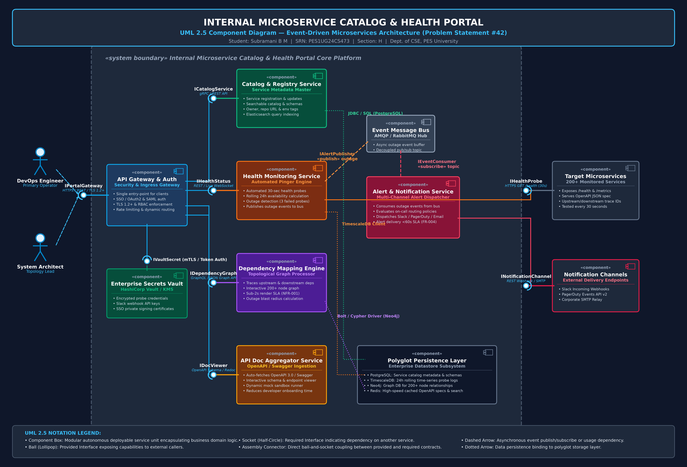
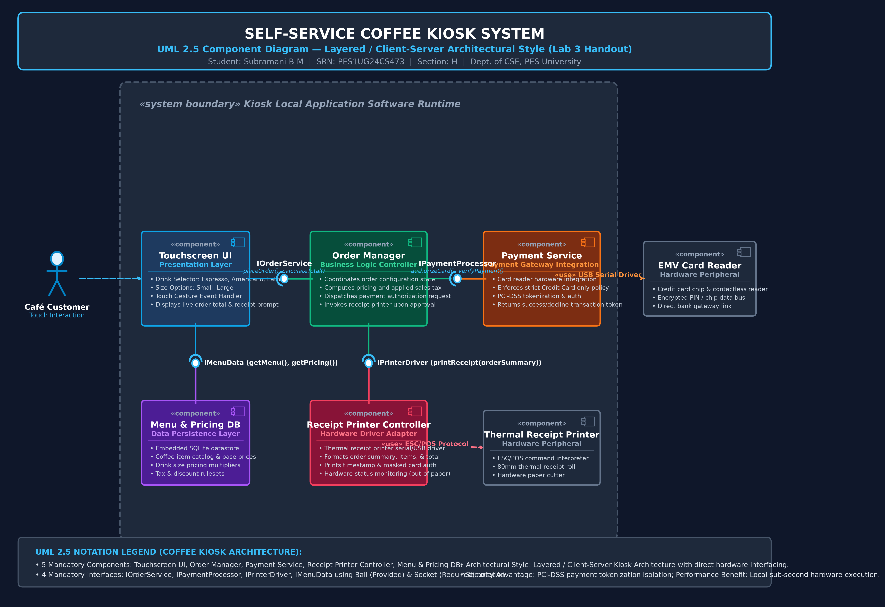
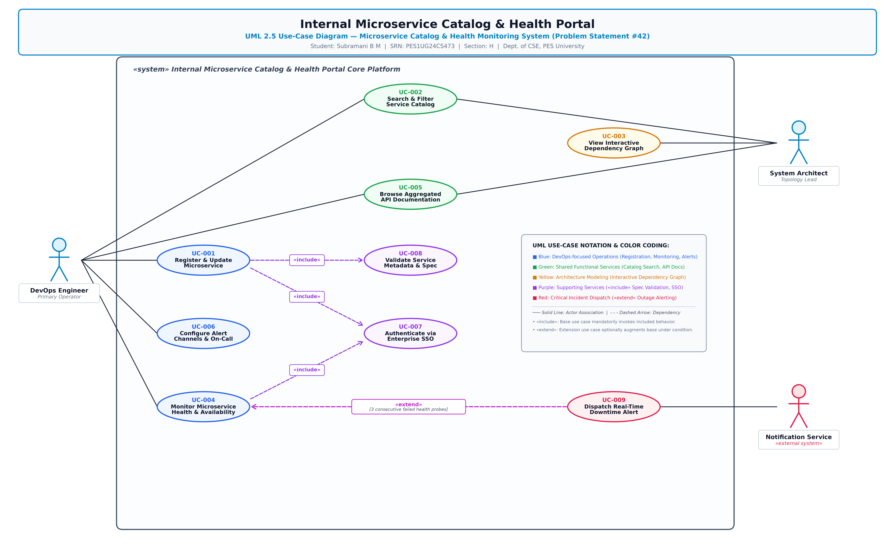
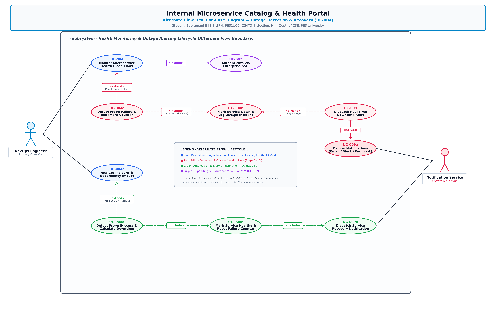

# Problem Statement #42 — Internal Microservice Catalog & Health Portal

**Course:** Software Engineering Lab — Requirements Engineering, UML Modelling, Agile Jira & Component Architecture  
**Department:** Dept. of CSE, PES University  
**Student Name:** Subramani B M  
**SRN:** PES1UG24CS473  
**Section:** H  
**Domain:** Developer Tools & IT Operations  
**Target Stakeholders / Actors:** DevOps Engineer, System Architect  

---

## Problem Context & Overview

An enterprise developer portal mapping microservice dependencies, aggregating API documentation, and running automated periodic health check pingers with downtime alerts.

---

## Deliverables Summary

### 📂 Lab 1: Requirements Engineering & UML Use-Case Modelling

| # | Deliverable | Format | File Link |
|---|---|---|---|
| **0** | **Original Problem Statement** | PDF | [42_SE_Lab1_SE_Problem_Statements.pdf](42_SE_Lab1_SE_Problem_Statements.pdf) |
| **1** | **Complete Requirements Table** (FR-001 to FR-005, NFR-001 & NFR-002) with ID, Type, Description, Priority, Acceptance Criteria, and Rationale | Markdown & PDF | [requirements.md](requirements.md)<br>[requirements.pdf](requirements.pdf) *(1-Page Formatted PDF)* |
| **2** | **UML Use-Case Diagram (Primary System)** (Actors, Use Cases, System Boundary, `«include»` & `«extend»` relationships) | draw.io + StarUML + PNG | [use_case_diagram.drawio](use_case_diagram.drawio) (draw.io)<br>[use_case_diagram.mdj](use_case_diagram.mdj) (StarUML)<br>[use_case_diagram.png](use_case_diagram.png) (Preview) |
| **3** | **Alternate Flow UML Use-Case Diagram** (Outage Detection, Multi-Channel Alerting & Auto-Recovery Lifecycle) | draw.io + StarUML + PNG | [alternate_flow_use_case_diagram.drawio](alternate_flow_use_case_diagram.drawio) (draw.io)<br>[alternate_flow_use_case_diagram.mdj](alternate_flow_use_case_diagram.mdj) (StarUML)<br>[alternate_flow_use_case_diagram.png](alternate_flow_use_case_diagram.png) (Preview) |
| **4** | **Use-Case Flow Specification** (1-Page specification for *Monitor Service Health* with Preconditions, Postconditions, Main Success Scenario, Alternate Flow) | Markdown & PDF | [use_case_flow_specification.md](use_case_flow_specification.md)<br>[use_case_flow_specification.pdf](use_case_flow_specification.pdf) *(1-Page Formatted PDF)* |
| **5** | **Exception Flow Specification** (Fault handling for Network Timeout, Notification Delivery Failure, TLS Violation, Secrets Vault Unreachable, SSO Token Expiry) | Markdown & PDF | [exception_flow_specification.md](exception_flow_specification.md)<br>[exception_flow_specification.pdf](exception_flow_specification.pdf) *(1-Page Formatted PDF)* |

---

### 📂 Lab 2: Agile Jira Hands-On Deliverables

| # | Deliverable | Space / Project | File Link |
|---|---|---|---|
| **1** | **Kanban Project Deliverable** | `Kanban_BPS#42` (`KBPS42`) | **[Kanban.PDF](Kanban.PDF)** *(3-Page Complete PDF with 6 Screenshots)* |
| **2** | **Scrum Project Deliverable** | `Scrum_BPS#42` (`SBP42`) | **[Scrum.PDF](Scrum.PDF)** *(3-Page Complete PDF with Burndown Chart & Reflections)* |
| **3** | **Bug Tracking Deliverable** | `BugTracker_BPS#42` (`BTBPS42`) | **[BugReport.PDF](BugReport.PDF)** *(2-Page Complete PDF with Defect Logs)* |
| **Ref** | **Lab 2 Reference Docs & Handout** | Markdown & PDF | [kanban_jira_reference.md](kanban_jira_reference.md)<br>[scrum_jira_reference.md](scrum_jira_reference.md)<br>[bugtracker_jira_reference.md](bugtracker_jira_reference.md)<br>[Lab_2_Jira_Student_Handout.pdf](Lab_2_Jira_Student_Handout.pdf) |

---

### 📂 Lab 3: Component Modelling & Architectural Pattern Selection

| # | Deliverable | Format | File Link | Description |
|---|---|---|---|---|
| **1** | **UML Component Diagram (PS #42)** | draw.io + StarUML + PNG + PDF | [component_diagram.png](component_diagram.png)<br>[component_diagram.pdf](component_diagram.pdf)<br>[component_diagram.drawio](component_diagram.drawio)<br>[component_diagram.mdj](component_diagram.mdj) | 6 Core Components, 7 Interfaces (Ball/Socket), Assembly Connectors, Polyglot DBs, EventBus, Secrets Vault. |
| **2** | **Architectural Justification (PS #42)** | PDF, Word (.docx), Markdown | [architectural_justification.pdf](architectural_justification.pdf) *(1-Page PDF)*<br>[architectural_justification.docx](architectural_justification.docx) *(Word Doc)*<br>[architectural_justification.md](architectural_justification.md) | Technical justification selecting **Microservices Architecture** with 2 scenario reasons, security advantage, and performance benefit. |
| **3** | **Combined Master Lab 3 Deliverable** | PDF | **[Lab_3_Component_Modeling_PES1UG24CS473.pdf](Lab_3_Component_Modeling_PES1UG24CS473.pdf)** | Complete submission report containing 1-page Justification + High-Res Component Diagram page. |
| **4** | **Coffee Kiosk Scenario Deliverables** *(Handout Example)* | draw.io + PNG + PDF + DOCX + MD | [coffee_kiosk_component_diagram.png](coffee_kiosk_component_diagram.png)<br>[coffee_kiosk_justification.pdf](coffee_kiosk_justification.pdf)<br>[coffee_kiosk_component_diagram.drawio](coffee_kiosk_component_diagram.drawio)<br>[coffee_kiosk_justification.docx](coffee_kiosk_justification.docx) | 5 Components (Touchscreen UI, Order Manager, Payment Service, Printer Controller, Menu DB) + 4 Interfaces. |
| **Folder** | **Submission Directory Standards** | Directories | [`2-Folder for Architectural Diagram`](2-Folder%20for%20Architectural%20Diagram/)<br>[`LAB 3/Problem_Statement_42`](LAB%203/Problem_Statement_42/)<br>[`LAB 3/Coffee_Kiosk_Scenario`](LAB%203/Coffee_Kiosk_Scenario/) | Fully organized folders adhering to official GitHub submission guidelines. |

---

## Lab 3 Architecture Selection Summary

> **"We chose Microservices Architecture (Event-Driven with API Gateway) for the Internal Microservice Catalog & Health Portal System."**

### Component & Interface Specification (Problem Statement #42)

| Component Name | Type / Layer | Provided Interface (Ball) | Required Interface (Socket) | Primary Responsibility |
|:---|:---|:---|:---|:---|
| **API Gateway & Auth Service** | Edge / Ingress | `IPortalGateway` (HTTPS / REST) | `ICatalogService`, `IHealthStatus`, `IDependencyGraph`, `IDocViewer`, `IVaultSecret` | TLS termination, SSO OAuth2/SAML validation, RBAC, and client request routing |
| **Catalog & Registry Service** | Core Domain | `ICatalogService` (gRPC / REST) | `JDBC/SQL` (PostgreSQL) | Searchable microservice registry, metadata management, and elastic indexing |
| **Health Monitoring Service** | Telemetry Core | `IHealthStatus` (WebSocket / REST) | `IHealthProbe` (HTTPS GET), `IAlertPublisher` (AMQP) | 30s health pings, rolling 24h availability calculation, outage detection (3 fails) |
| **Dependency Mapping Engine** | Graph Processing | `IDependencyGraph` (GraphQL / JSON) | `Bolt / Cypher` (Neo4j Graph DB), `ICatalogService` | Automated dependency discovery, interactive 200+ node graph generation (<2s SLA) |
| **Alert & Notification Service** | Notification Dispatch | `IAlertConfig` (REST) | `IEventConsumer` (AMQP), `INotificationChannel` (Slack/SMTP) | Event-driven alert evaluation and guaranteed multi-channel dispatch within 60s (FR-004) |
| **API Doc Aggregator Service** | Developer Portal | `IDocViewer` (OpenAPI UI / Redoc) | `ISpecFetcher` (Git/HTTP), `Redis Driver` | Ingests, parses, and validates OpenAPI 3.0 specs; serves interactive API sandboxes |

---

## UML Component Diagram (Problem Statement #42)



---

## Coffee Kiosk Component Diagram (Handout Scenario)



---

## Primary UML Use-Case Diagram (Lab 1)



---

## Alternate Flow UML Use-Case Diagram (Lab 1)



---

## Repository Structure

```
.
├── 1-Folder for RE/                              # Official Lab Submission Folder: Requirements Engineering
│   ├── requirements.md                           # Complete Requirements Table (FR-001 to FR-005, NFR-001 & 002)
│   ├── requirements.pdf                          # Formatted 1-Page Requirements Table PDF
│   ├── use_case_diagram.drawio                   # Primary Use-Case Diagram (draw.io)
│   ├── use_case_diagram.mdj                      # Primary Use-Case Diagram (StarUML)
│   ├── use_case_diagram.png                      # Primary Use-Case Diagram (PNG)
│   ├── alternate_flow_use_case_diagram.drawio    # Alternate Flow Diagram (draw.io)
│   ├── alternate_flow_use_case_diagram.mdj       # Alternate Flow Diagram (StarUML)
│   ├── alternate_flow_use_case_diagram.png       # Alternate Flow Diagram (PNG)
│   ├── use_case_flow_specification.md            # Primary Flow Specification (Markdown)
│   ├── use_case_flow_specification.pdf           # Primary Flow Specification (PDF)
│   ├── exception_flow_specification.md           # Exception Flow Specification (Markdown)
│   └── exception_flow_specification.pdf          # Exception Flow Specification (PDF)
├── 2-Folder for Architectural Diagram/           # Official Lab Submission Folder: Architectural & Component Diagrams
│   ├── Lab_3_Component_Modeling_PES1UG24CS473.pdf# Master Lab 3 combined submission PDF
│   ├── component_diagram.drawio                  # UML 2.5 Component Diagram (draw.io XML)
│   ├── component_diagram.png                     # UML 2.5 Component Diagram (High-Res PNG)
│   ├── component_diagram.pdf                     # UML 2.5 Component Diagram (Landscape PDF)
│   ├── component_diagram.mdj                     # UML 2.5 Component Diagram (StarUML Model)
│   ├── architectural_justification.md            # Technical Architectural Justification (Markdown)
│   ├── architectural_justification.pdf           # Formatted 1-Page Architectural Justification (PDF)
│   ├── architectural_justification.docx          # Formatted 1-Page Architectural Justification (Word)
│   ├── coffee_kiosk_component_diagram.drawio     # Coffee Kiosk Component Diagram (draw.io XML)
│   ├── coffee_kiosk_component_diagram.png        # Coffee Kiosk Component Diagram (PNG)
│   ├── coffee_kiosk_component_diagram.pdf        # Coffee Kiosk Component Diagram (PDF)
│   ├── coffee_kiosk_component_diagram.mdj        # Coffee Kiosk Component Diagram (StarUML Model)
│   ├── coffee_kiosk_justification.md             # Coffee Kiosk Justification (Markdown)
│   ├── coffee_kiosk_justification.pdf            # Coffee Kiosk Justification (PDF)
│   └── coffee_kiosk_justification.docx           # Coffee Kiosk Justification (Word)
├── LAB 3/                                        # Lab 3 Working Handout & Submissions
│   ├── Lab_3_Architecture_Student_handout.pdf    # Lab 3 instructions & rubrics
│   ├── Git Hub Project Submission Details.docx   # Submission nomenclature instructions
│   ├── Problem_Statement_42/                     # Lab 3 Deliverables for Problem Statement #42
│   └── Coffee_Kiosk_Scenario/                    # Lab 3 Deliverables for Coffee Kiosk Scenario
├── 42_SE_Lab1_SE_Problem_Statements.pdf          # Lab 1: Original problem statement handout (PS #42)
├── Lab_2_Jira_Student_Handout.pdf                # Lab 2: Jira student handout
├── Kanban.PDF                                    # Lab 2 Deliverable 1: Kanban project PDF (6 screenshots)
├── Scrum.PDF                                     # Lab 2 Deliverable 2: Scrum project PDF (burndown chart + reflections)
├── BugReport.PDF                                 # Lab 2 Deliverable 3: Bug tracking project PDF
├── README.md                                     # Master index and student information
└── Screenshots/                                  # Jira and project screenshot assets
```
